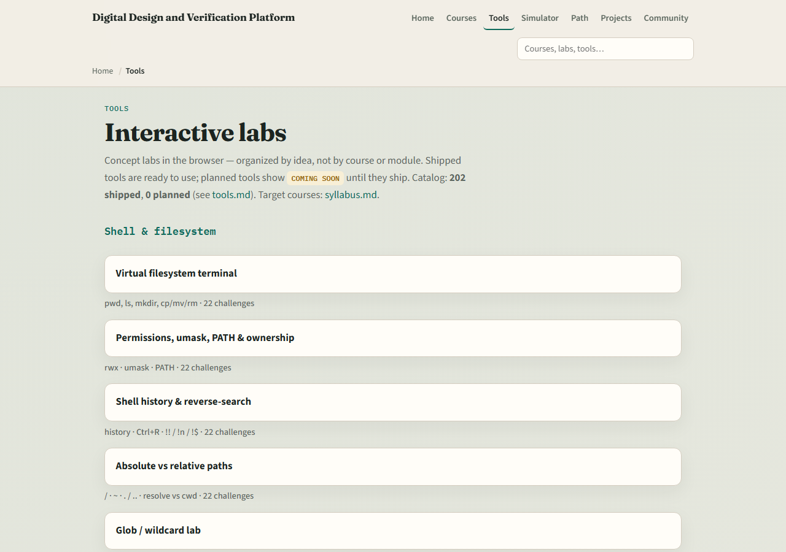

# Welcome to Verilator

Welcome to learn Verilator

---

## What you will build toward
- Glance at pass rate and coverage before sign-off
- Module ten is an offline build-and-run capstone; module eleven closes the loop

---

## Two tracks, one idea
- Track A is real Verilator on your machine
- Metrics ideas
- You may do either track, or both
- A good rhythm is browser lab first for the vocabulary, then Track A for fidelity

---

## Set up Track A
- Install Verilator and confirm the version command works in your shell
- Open this course folder and skim module READMEs and EXAMPLES prompts as you go
- When a module offers a self-check script, use it to grade checklist items
- Keep the sibling Icarus course in mind, you will compare the two tools early on

---

## Set up Track B
- From the monorepo root
- All nine Verilator browser labs ship on the live site too
- Confirm you can reach the index

---

## How to move through modules
- For each module
- Prefer Track B when you want graded challenges
- When you finish this intro checklist, continue to Icarus versus Verilator

