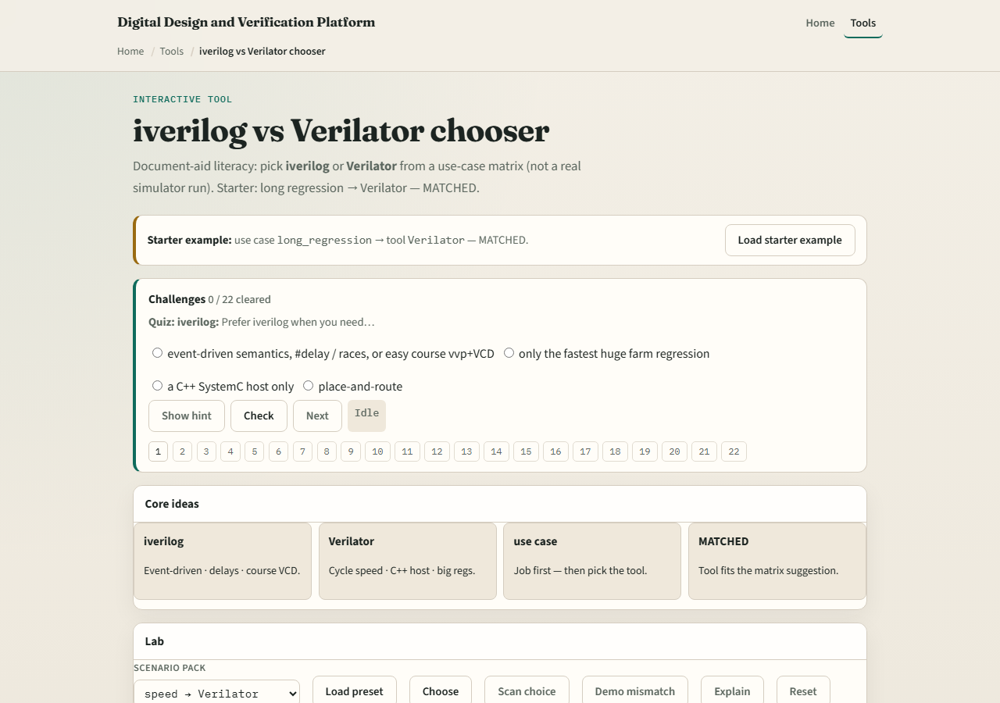

# iverilog vs Verilator

Before you compile anything, pick the right engine for the job

---

## Match the scenario
- Use Icarus when the lesson is hash delays, initial blocks
- Use Verilator when the job is a Makefile regression farm
- The browser lab presents matched scenarios: same design idea, different tool fit
- Read the scenario before you click a answer

---

## Browser lab

---

## Real Verilator practice
- In Track A, open this module’s EXAMPLES prompts and the legacy course tree
- Run one tiny design with Icarus for event-style sanity
- You do not need a perfect port

---

## Pitfalls to watch
- Do not reach for Verilator when the lesson requires hash delays and timing checks Icarus
- Do not reach for Icarus when you need fast cycle regressions at scale
- Do not assume “simulator is simulator”, paradigm mismatch wastes afternoons
- And do not treat the browser lab as proof your install works; that is Track A’s job

---

## Your turn
- Complete the checklist for at least one track, preferably both
- In the browser, finish matched scenarios with ready status
- In Track A, name one job for each tool from your own work
- When you are ready, take the short quiz, then continue to the simulation pipeline

