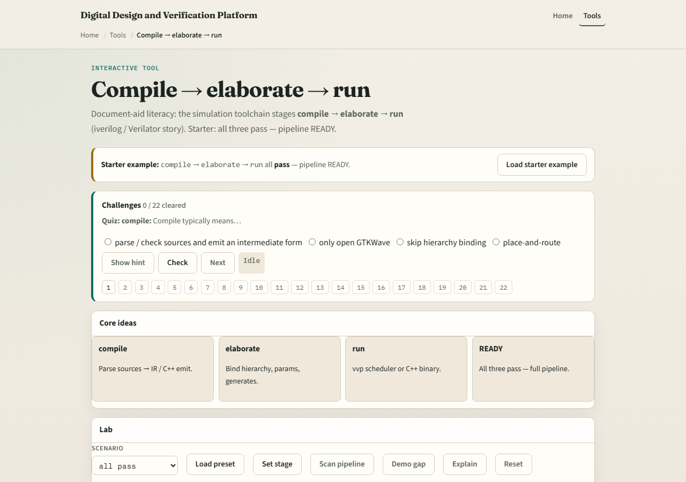

# Module 02 — Compile → elaborate → run

**Module id:** module02-sim-pipeline
**Lab:** sim-pipeline
**Tracks:** A (real Verilator + C++/Makefile) · B (browser lab)

## Slide 1 — The simulation pipeline

Every simulator run is a pipeline: compile sources, elaborate the design hierarchy, then execute time. Icarus and Verilator share that story even when the commands differ. If you cannot name the stage that failed, you will debug the wrong log file.

## Slide 2 — Verilator’s compile-to-binary path

Verilator’s common flow is compile with the C++ emit flag, build the generated model plus your host, then run the binary. Elaboration happens inside Verilator’s front end; the artifact you run is often an executable, not a standalone vvp-style interpreter. Status READY in the literacy lab means every stage completed—not merely “no red text somewhere.”

## Slide 3 — Browser lab

In the pipeline lab, load the starter and walk compile, elaborate, and run stages for both tool shapes. Drag or click until the pipeline reads ready. Challenges call out missing stages—compile without run, run without elaborate—and ask you to repair the order.

## Slide 4 — Real Verilator practice

In Track A, open EXAMPLES and run one minimal Verilator compile that emits C++, then make and execute the binary. Say out loud which log lines belong to compile versus link versus run. If the binary exits immediately, check whether the testbench host actually stepped time.

## Slide 5 — Pitfalls to watch

Do not treat “verilator ran” as “simulation succeeded”—did you build and run the host? Do not debug waves when compile never finished. Do not compare Icarus and Verilator commands flag-for-flag; compare stages. And remember READY is a whole pipeline, not one green checkbox.

## Slide 6 — Your turn

Complete the checklist for at least one track—preferably both. In the browser, reach ready on the pipeline diagram. In Track A, run compile, build, and execute once on a tiny design. When you are ready, take the short quiz, then continue to Verilator lint.
