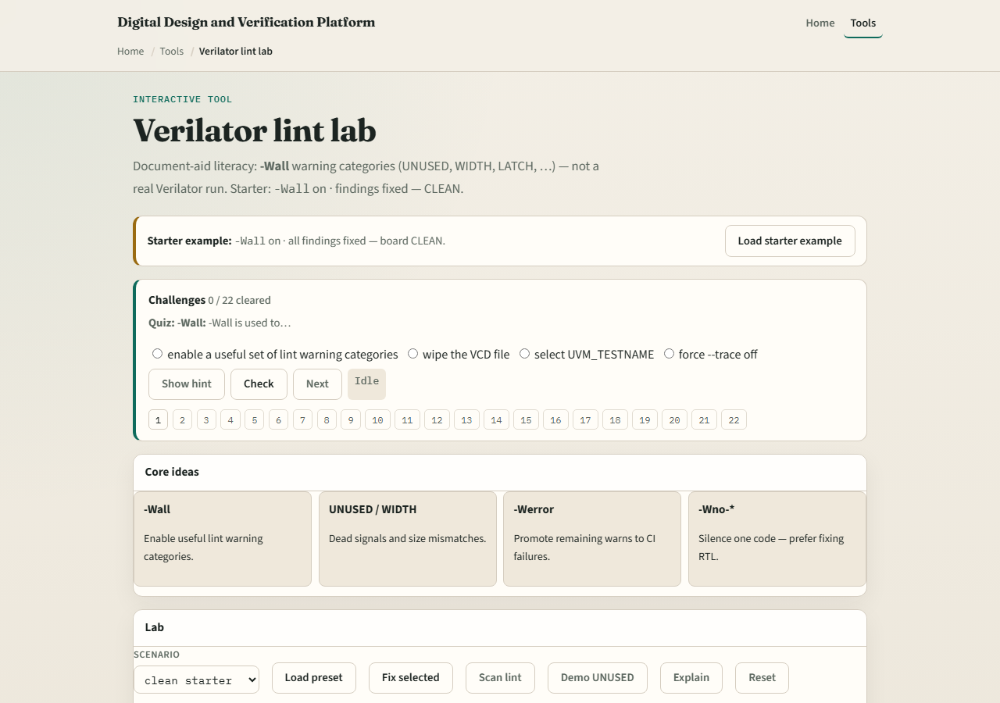

# Module 03 — Verilator lint

**Module id:** module03-verilator-lint-lab
**Lab:** verilator-lint-lab
**Tracks:** A (real Verilator + C++/Makefile) · B (browser lab)

## Slide 1 — Verilator lint

Lint is cheap insurance. Verilator’s linter catches width mismatches, unused signals, inferred latches, and incomplete case statements before you spend an hour in waves. Turn warnings on with wall-class strictness and treat CLEAN, BLIND, and warnings-as-errors as deliberate policy choices—not accidents.

## Slide 2 — Common warning families

Watch for UNUSED—something you declared but never read. WIDTH—expressions that do not line up. LATCH—inferred storage you did not mean. CASEINCOMPLETE—case statements without a default or full coverage. The literacy lab tags these families so you learn the fix, not only the flag name.

## Slide 3 — Browser lab

In the lint lab, load the starter design and practice CLEAN versus BLIND versus warnings-as-error modes. A BLIND run hides problems; CLEAN surfaces them; treating warnings as errors forces zero tolerance. Challenges ask you to fix RTL—not merely silence with blanket no-warning flags.

## Slide 4 — Real Verilator practice

In Track A, lint a tiny module with wall-level warnings enabled. Introduce one intentional WIDTH or UNUSED issue, see the message, then fix the RTL properly. Avoid the reflex to blanket-disable warnings unless you have documented why. Self-check scripts can confirm you reached a clean lint pass.

## Slide 5 — Pitfalls to watch

Do not blanket-disable warnings to greenwash a broken design. Do not confuse BLIND with CLEAN—no output is not the same as no problems. Do not ship with warnings-as-errors until your tree is actually clean. And remember: lint passes do not replace simulation—they narrow the search space.

## Slide 6 — Your turn

Complete the checklist for at least one track—preferably both. In the browser, reach CLEAN on at least one challenge without only silencing flags. In Track A, run lint with strict warnings once. When you are ready, take the short quiz, then continue to C++ testbench and DPI.
