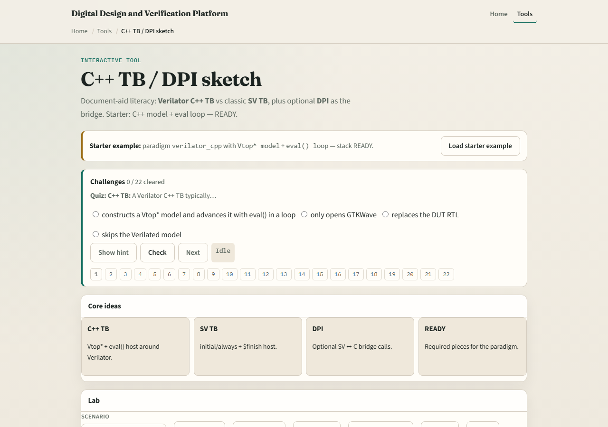

# C++ host testbench

Verilator’s native cosim shape is a C++ host driving a generated model pointer, traditionally Vtop, inside an eval loop

---

## Eval loop vs SV TB
- The host allocates the model, toggles inputs, calls eval for each time step
- DPI can bridge to C functions when you need it
- A classic SV testbench compiled elsewhere follows different rules

---

## Browser lab

---

## Real Verilator practice
- In Track A, open a minimal C++ host example from EXAMPLES or the legacy tree
- Point to where the model is constructed, where eval is called in a loop
- If DPI appears

---

## Pitfalls to watch
- Do not mix a full SV event testbench paradigm with a Verilator C++ main in the same flow
- Do not call eval once and assume time advanced forever
- Do not treat DPI as mandatory, many flows are pure C++
- And do not debug RTL in waves before confirming the host actually stepped cycles

---

## Your turn
- Complete the checklist for at least one track, preferably both
- In the browser, label host, model, and eval loop correctly
- In Track A, run one tiny C++ host binary once
- When you are ready, take the short quiz, then continue to clock and reset patterns

