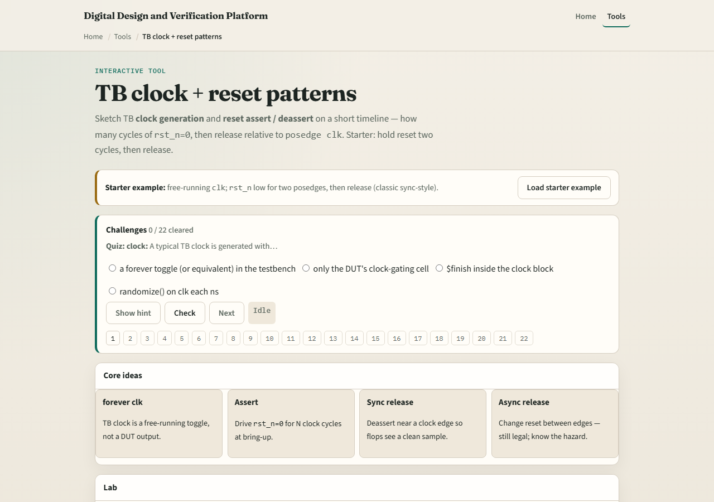

# Clock and reset in the host

Every Verilator run needs a disciplined clock and reset story

---

## Assert, wait, release
- Assert reset low or high consistently with your active level
- Count posedges while reset is held, often two or three is enough for literacy
- Release reset synchronously relative to the clock edge you care about
- After release, let the DUT run

---

## Browser lab

---

## Real Verilator practice
- In Track A, open EXAMPLES and implement or inspect a host loop that toggles clock with
- Run once and confirm outputs change only after reset deasserts
- Say how many posedges you waited, make the number intentional

---

## Pitfalls to watch
- Do not hold reset forever and call it a passing test
- Do not release reset asynchronously if your DUT expects synchronous deassert
- Do not forget the clock entirely in a C++ host, eval needs input changes
- And do not copy a browser sketch verbatim without matching your DUT’s reset polarity

---

## Your turn
- Complete the checklist for at least one track, preferably both
- In the browser, reach ready with a synchronous release pattern
- In Track A, run one reset sequence you can explain out loud
- When you are ready, take the short quiz, then continue to Verilator trace

