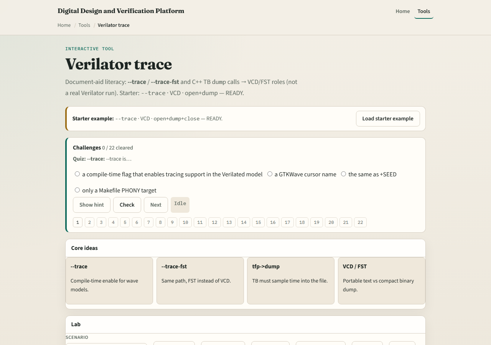

# Turning trace on

Waves require two cooperating pieces

---

## Flag plus dump calls
- Enable trace at compile with the trace or trace-fst flags as your flow requires
- In the host, create a trace pointer, open a file, call dump each eval step you care about,
- Dump without the compile flag is BLIND, you wrote files the model never instrumented
- Both sides must agree

---

## Browser lab

---

## Real Verilator practice
- In Track A, run a tiny design with trace enabled, produce a wave file
- Point to the host lines that open and dump
- Delete dump temporarily and notice OPEN behavior; compare to a correct run
- Keep the file small, this module is trace literacy, not a farm dump

---

## Pitfalls to watch
- Do not enable trace and forget dump in the eval loop
- Do not dump when compile never enabled trace, BLIND files mislead you
- Do not leave trace files unclosed on long runs, flush and close matter
- And do not open gigabyte waves when a short window suffices

---

## Your turn
- Complete the checklist for at least one track, preferably both
- In the browser, fix OPEN and BLIND scenarios to ready
- In Track A, generate one viewable trace from a short run
- When you are ready, take the short quiz, then continue to wave dump literacy

