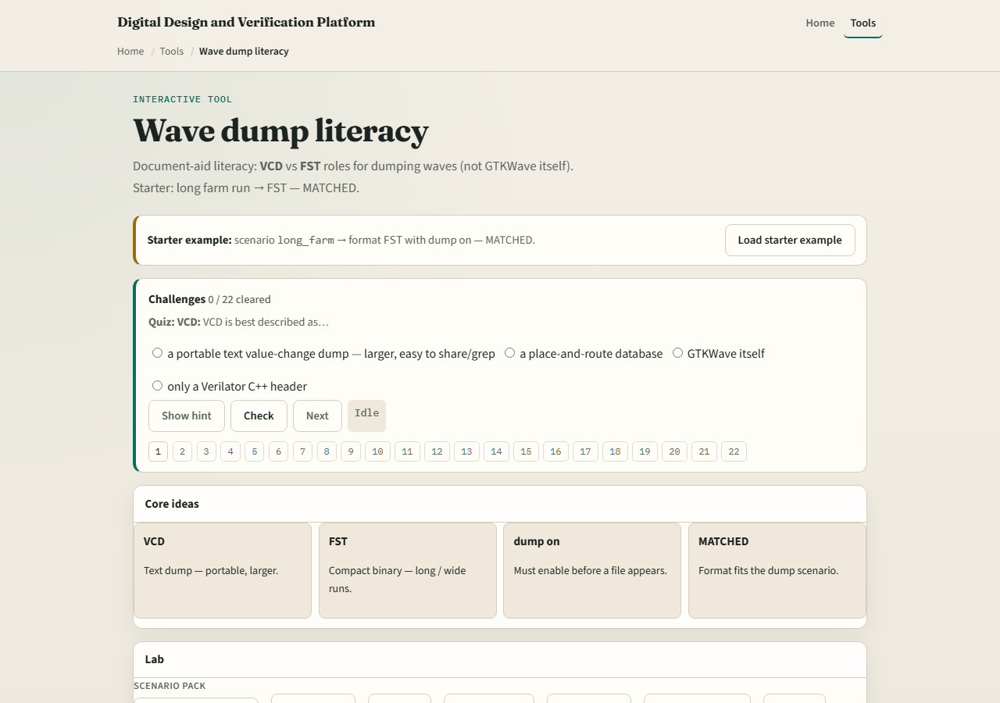

# Pick the wave format

VCD is familiar and portable for quick debug

---

## Scenario-first choice
- For quick debug on a tiny block, VCD is often fine
- For overnight farms with millions of cycles, prefer FST to keep disks sane
- When you share a snippet with a colleague on another tool
- Regardless of format

---

## Browser lab

---

## Real Verilator practice
- In Track A, produce one small VCD and, if your flow supports it, one small FST from the
- Compare file sizes and open both in your viewer
- Note which Makefile variables or flags differ
- Keep runs short, this is format literacy, not volume testing

---

## Pitfalls to watch
- Do not pick FST then forget trace-fst at compile
- Do not share a zero-byte file because dump never ran
- Do not use farm-scale dumps for a five-signal typo debug
- And do not assume every viewer supports every format, check before you send

---

## Your turn
- Complete the checklist for at least one track, preferably both
- In the browser, pass scenario chooser challenges with dump truly enabled
- In Track A, open one real trace you created
- When you are ready, take the short quiz, then continue to Verilator public visibility

