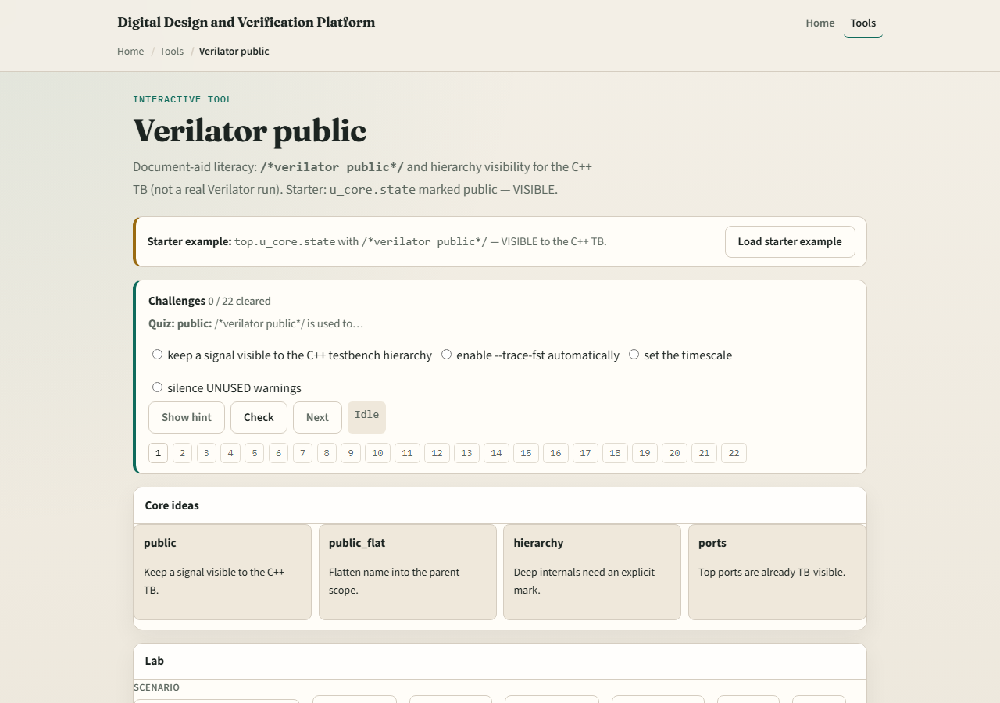

# Exposing signals to C++

Not every internal net is visible to your C++ testbench by default

---

## Public, hidden, and ports
- Ports are your contract, no pragma required for normal top-level access patterns
- Unmarked internals are HIDDEN from the host’s perspective unless you peek via hierarchy
- Mark selectively with the public comment when a scoreboard or checker in C++ must read an
- More exposure slows compile and couples TB to implementation details

---

## Browser lab

---

## Real Verilator practice
- In Track A, take a tiny module with one internal counter
- Run once without public markers and note what the host cannot see
- Add a public marker on the one net you must observe, recompile, and confirm access
- Remove gratuitous markers before you commit, minimal is the rule

---

## Pitfalls to watch
- Do not mark every signal public to avoid thinking about interfaces
- Do not assume ports need the pragma, they already belong to the boundary
- Do not hide required check signals and then debug blind in C++
- And remember recompile is required after marker changes, this is not a runtime poke

---

## Your turn
- Complete the checklist for at least one track, preferably both
- In the browser, pass minimal-marking challenges
- In Track A, expose one internal net intentionally and read it from the host
- When you are ready, take the short quiz, then continue to verification metrics

